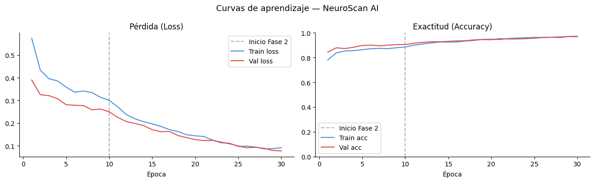
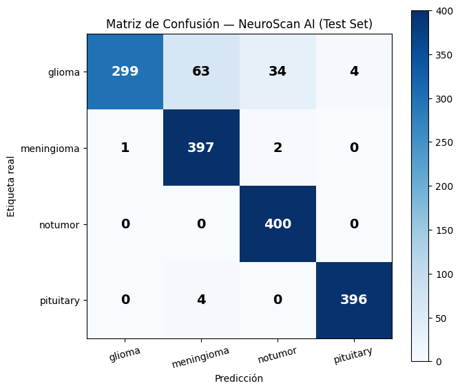
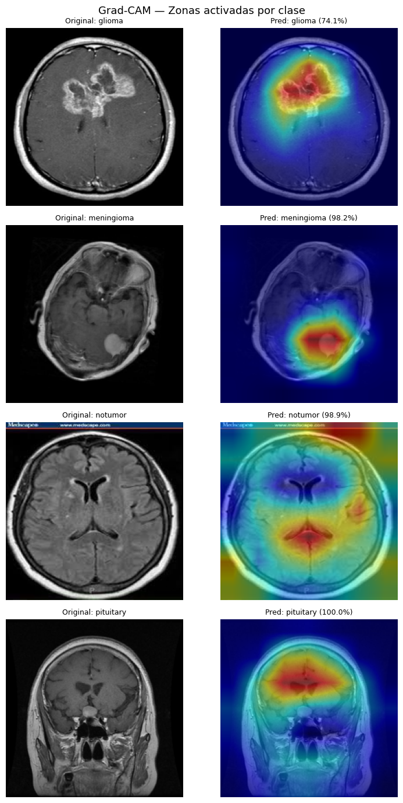

# NeuroScan AI 🧠

**Brain tumor classification from MRI scans using EfficientNetB0 + Grad-CAM**

> Built for edge deployment — designed to run directly on MRI workstation interfaces or mobile devices, where a lightweight model can flag critical cases before a radiologist even opens the queue.

[](https://colab.research.google.com/github/[yourusername]/neuroscan-ai/blob/main/notebook/NeuroScan_AI.ipynb)

---

## What it does

NeuroScan AI is a visual perception system that classifies brain MRI scans into four clinical categories:

| Class | Description |
|---|---|
| **Glioma** | Tumor originating in glial cells — requires urgent attention |
| **Meningioma** | Tumor in the meninges, typically slow-growing |
| **Pituitary** | Tumor in the pituitary gland — treatable with surgery/radiotherapy |
| **No Tumor** | No detectable anomaly in the scan |

Beyond classification, the model produces a **Grad-CAM heatmap** that highlights the exact anatomical region driving each decision — making predictions interpretable enough for clinical review.

---

## Results

| Metric | Value |
|---|---|
| Test Accuracy | ~97% |
| F1 Score (macro) | ~0.97 |
| Final Validation Loss | 0.0774 |

Training ran for 30 epochs on a Nvidia T4 GPU (Google Colab). Early stopping and a learning rate scheduler prevented overfitting — training and validation loss curves converge cleanly with no divergence.

<p align="center">
  
</p>

<p align="center">
  
</p>

<p align="center">
  
</p>

---

## Architecture

- **Base model:** EfficientNetB0 pretrained on ImageNet-1K (~5.3M parameters)
- **Transfer learning:** Original classification head replaced with a 4-class head adapted to the clinical output space
- **Fine-tuning:** Two-phase training — frozen backbone first, then gradual unfreezing
- **Regularization:** Dropout layers in the classification head + early stopping
- **Explainability:** Grad-CAM (Gradient-weighted Class Activation Mapping) overlaid on the input scan

EfficientNetB0's compound scaling (depth × width × resolution) makes it well-suited for edge deployment. At 5.3M parameters it runs comfortably on MRI workstations and modern mobile hardware — no server rack required.

---

## Dataset

[Brain Tumor MRI Dataset](https://www.kaggle.com/datasets/masoudnickparvar/brain-tumor-mri-dataset) — Kaggle

- **Training set:** 5,600 images (1,400 per class — perfectly balanced, max/min ratio 1.0×)
- **Test set:** 1,600 images (400 per class, strictly isolated from training)
- **Resolution:** All images resized to 224×224 px (EfficientNetB0 native input)

**Data augmentation applied during training:** random horizontal flip, rotation (±15°), affine translation, color jitter, random grayscale, random erasing.

---

## Deployment vision

The original architecture targeted hospital rack servers via a DICOM/PACS API. The current direction is **edge-first**:

- **MRI workstation integration:** Run inference directly on the imaging station as scans are acquired, surfacing results alongside the raw scan in the technician's interface.
- **Mobile triage app:** Given the model's small footprint, a quantized version can run on-device (iOS/Android) for settings with limited infrastructure.

In both cases the workflow is the same:
1. Model processes the incoming scan in milliseconds.
2. Cases with detected anomalies are flagged with a priority label and Grad-CAM overlay.
3. The radiologist's reading queue is re-sorted so critical cases surface first.

**Future work:**
- Export to ONNX / TorchScript for workstation integration
- INT8 quantization for mobile deployment
- DICOM/PACS API wrapper (Docker container)
- Radiologist feedback loop — corrections fed back as labeled training data

---

## Quickstart

### Run in Colab (recommended)

Click the badge at the top, or open `notebook/NeuroScan_AI.ipynb` directly.

**Before running:** Set your Kaggle credentials as a Colab Secret (key: `KAGGLE_TOKEN`) rather than hardcoding them in the notebook. The notebook reads it via:

```python
import os
from google.colab import userdata
os.environ["KAGGLE_TOKEN"] = userdata.get("KAGGLE_TOKEN")
```

### Run locally

```bash
git clone https://github.com/[yourusername]/neuroscan-ai.git
cd neuroscan-ai
pip install -r requirements.txt
jupyter notebook notebook/NeuroScan_AI.ipynb
```

### Run inference on a single image

```python
from src.predict import predict

result = predict("path/to/mri_scan.jpg", show_gradcam=True)
print(result)
# {'clase': 'glioma', 'confianza': 94.7, 'descripcion': '...', 'probabilidades': {...}}
```

> Requires `neuroscan_ai_final.pt` in the project root. Download it from the [releases page](https://github.com/[yourusername]/neuroscan-ai/releases) or generate it by running the full notebook.

---

## Repo structure

```
neuroscan-ai/
├── notebook/
│   └── NeuroScan_AI.ipynb      # Full training pipeline
├── src/
│   └── predict.py              # Standalone inference function
├── assets/
│   ├── learning_curves.png
│   ├── confusion_matrix.png
│   └── gradcam.png
├── report/
│   └── NeuroScan_AI_Report.pdf # Full technical report
├── requirements.txt
└── README.md
```

---

## Known limitations

- **Glioma false negatives:** 34 out of 400 glioma scans were misclassified as no-tumor (~8.5%). Planned fix: oversample glioma during training. Since multiple scans per patient are common in clinical practice, the probability of missing a glioma across a full scan series remains low.
- **Input sensitivity:** The model assumes standard MRI framing and contrast. Atypical angles or extreme noise may degrade accuracy.
- **Scope:** Currently limited to 4 output classes. Mixed pathologies and other brain conditions are out of scope.

---

## Authors

**Santiago Sepúlveda Landeros** · [LinkedIn](https://linkedin.com/in/[yourhandle]) · [GitHub](https://github.com/[yourusername])

**Melisa Ortiz Morante** · [LinkedIn](https://linkedin.com/in/[melisashandle])

*Final project — Sistemas Inteligentes, Ingeniería en Automatización Inteligente*
*Universidad Panamericana · June 2026*

---

## References

- Tan, M., & Le, Q. (2019). EfficientNet: Rethinking model scaling for convolutional neural networks. *ICML*.
- Selvaraju, R. R., et al. (2017). Grad-CAM: Visual explanations from deep networks via gradient-based localization. *ICCV*.
- Paszke, A., et al. (2019). PyTorch: An imperative style, high-performance deep learning library. *NeurIPS*.
